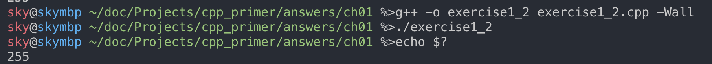
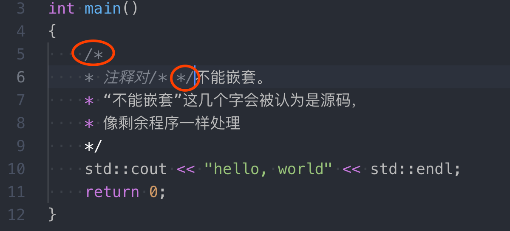

## 练习1.1

> 查阅你使用的编译器文档，确定它所使用的文件命名约定。编译并运行第2页的main程序。

### 1. 常见的C++文件扩展名
- 源文件：`.cpp`, `.cc`, `.cxx`, `.C`, `.c++`
- 头文件：`.h`, `.hpp`, `.hxx`

**Unix平台多为`.cc`，其他平台多为`.cpp`，头文件推荐使用`.h`或`.hpp`。**

参考链接:
 - [C++源文件的后缀名问题](https://www.cnblogs.com/bluestorm/archive/2012/09/05/2672527.html)
 - [*.h or *.hpp for your class definitions](https://stackoverflow.com/questions/152555/h-or-hpp-for-your-class-definitions)
 - [C++ code file extension? .cc vs .cpp](https://stackoverflow.com/questions/1545080/c-code-file-extension-cc-vs-cpp)
 - [.c vs .cc vs. .cpp vs .hpp vs .h vs .cxx [duplicate]](https://stackoverflow.com/questions/5171502/c-vs-cc-vs-cpp-vs-hpp-vs-h-vs-cxx)

### 2. 编译命令
对于GUN编译器套件来说，编译C++源文件需要在终端输入`g++ -o test test.cpp -Wall`,其中`-o test`指的编译生成的可执行文件是`test`,没有`-o`则默认是`a.out`; **`-Wall`是开启所有warning的意思，强烈推荐加上这个flag**。

要运行刚才生成的`test`需要在终端输入`./test`，要注意的是这里需要手动指定`test`的路径，即使在当前目录下，妄图输入`test`运行是不行的（因为直接输入`test`的话会在系统环境变量试图查找命令`test`）。

## 练习1.2

> 改写程序，让它返回-1。返回值-1通常被当作程序错误的标识。重新编译并运行你的程序，观察你的系统如何处理main返回的错误标识。

`exercise1_2.cpp`文件内容如下：
```C++
#include <iostream>

int main()
{
    return -1;
}
```
终端执行`g++ -o exercise1_2 exercise1_2.cpp -Wall`,然后`./exercise1_2`, 再`echo $?`，发现输出为`255`.
```
$ g++ -o exercise1_2 exercise1_2.cpp -Wall
$ ./exercise1_2
# Unix系统命令 echo $? 记录上一个程序的返回值（windows为echo %ERRORLEVEL%，输出-1）
$ echo $?
# 这里本来应该是-1的，但是Unix的程序exit code定义为8-bits的unsigned int, -1转8-bits unsigned int就是255(补码存储)
255
```


## 练习1.3

> 编写程序，在标准输出上打印 Hello, World。

```C++
#include <iostream>

int main()
{
    // std命名空间； << 输出运算符返回的是左侧的对象即ostream
    // endl有刷新缓存的作用，调试程序时应该加上
    std::cout << "hello, world" << std::endl;
    return 0;
}
```

## 练习1.4

> 我们的程序使用加法运算符+来将两个数相加。编写程序使用乘法运算符*，来打印两个数的积。

```C++
#include <iostream>

int main()
{
    int v1 = 0, v2 = 0;
    std::cout << "Enter two numbers:" << std::endl;
    std::cin >> v1 >> v2;
    std::cout << "The product of number " << v1 << " and " << v2 
              << " is " << v1 * v2 << std::endl;
    return 0;
}
```

## 练习1.5

> 我们将所有输出操作放在一条很长的语句中。重写程序，将每个运算对象的打印操作放在一条独立的语句中。

```C++
#include <iostream>

int main()
{
    int v1 = 0, v2 = 0;
    std::cout << "Enter two numbers:" << std::endl;
    std::cin >> v1 >> v2;
    std::cout << "The product of number ";
    std::cout << v1;
    std::cout << " and ";
    std::cout << v2;
    std::cout << " is ";
    std::cout << v1 * v2 << std::endl;
    return 0;
}
```

## 练习1.6

> 解释下面程序片段是否合法。
```C++
std::cout << "The sum of " << v1;
          << " and " << v2;
          << " is " << v1 + v2 << std::endl;
```
如果程序是合法的，它输出什么？如果程序不合法，原因何在？应该如何修正？

答案：程序不合法，编译结果为，
```
#       这里是第7行第5列的意思
exercise1_6.cpp:7:5: error: expected expression
    << " and " << v2;
    ^
exercise1_6.cpp:8:5: error: expected expression
    << " is " << v1 + v2 << std::endl;
    ^
2 errors generated.
```
原因：第一行程序末尾有了分号，说明第一行语句结束了；后面的两行应该是完整的新语句了，但是是以`<<`开头，显然这不是一个完整的语句，所以改为后面两行前也要加`std::cout`.

## 练习1.7

> 编译一个包含不正确的嵌套注释的程序，观察编译器返回的错误信息。

编译错误信息如下：
```
exercise1_7.cpp:6:16: warning: '/*' within block comment [-Wcomment]
    * 注释对/* */不能嵌套。
            ^
exercise1_7.cpp:6:33: error: non-ASCII characters are not allowed outside of literals and identifiers
    * 注释对/* */不能嵌套。
                         ^~
exercise1_7.cpp:7:7: error: non-ASCII characters are not allowed outside of literals and identifiers
    * “不能嵌套”这几个字会被认为是源码，
      ^
exercise1_7.cpp:7:22: error: non-ASCII characters are not allowed outside of literals and identifiers
    * “不能嵌套”这几个字会被认为是源码，
               ^
exercise1_7.cpp:6:21: error: use of undeclared identifier '不能嵌套'
    * 注释对/* */不能嵌套。
                 ^
exercise1_7.cpp:7:10: error: use of undeclared identifier '不能嵌套'
    * “不能嵌套”这几个字会被认为是源码，
       ^
exercise1_7.cpp:7:58: warning: treating Unicode character <U+FF0C> as identifier character rather than as ',' symbol [-Wunicode-homoglyph]
    * “不能嵌套”这几个字会被认为是源码，
                                      ^~
exercise1_7.cpp:7:58: error: non-ASCII characters are not allowed outside of literals and identifiers
    * “不能嵌套”这几个字会被认为是源码，
                                      ^~
2 warnings and 6 errors generated.
```

界定符对注释`/* */`中的`/*`会匹配第一个遇到的`*/`，然后`不能嵌套。`就当成了代码中的变量名/语句等等，gcc可能会报错`error: stray(意外的，走失的) '\262' in program`这类信息。由注释引发的错误通常是难以理解的，而且不同情况的错误信息不同。




## 练习1.8

> 指出下列哪些输出语句是合法的(如果有的话)：
```C++
std::cout << "/*";
std::cout << "*/";
std::cout << /* "*/" */;
std::cout << /* "*/" /* "/*" */;
```
预测编译这些语句会产生什么样的结果，实际编译这些语句来验证你的答案(编写一个小程序，每次将上述一条语句作为其主体)，改正每个编译错误。

答案：1、2、4对，3错误。
```C++
std::cout << "/*"; // right
std::cout << "*/"; // right
/*
* 第3个的错误信息
* warning: missing terminating '"' character [-Winvalid-pp-token]
* std::cout << /* "*/ " */;
*                     ^
* error: expected expression
*/
std::cout << /* "*/" */; / wrong，分号前应加单引号"
std::cout << /* "*/" /* "/*" */; // right，输出/*
```

## 练习1.9

> 编写程序，使用while循环将50到100的整数相加。

答案：
```C++
#include <iostream>

int main()
{
    int sum = 0, start = 50;
    while (start <= 100)
    {
        sum += start;
        ++start;
    }
    std::cout << "sum is " << sum << std::endl;
    return 0;
}
```

## 练习1.10
> 除了++运算符将运算对象的值增加1之外，还有一个递减运算符（--）实现将值减少1。编写程序，使用递减运算符在循环中按递减顺序打印出10到0之间的整数。

答案：
```C++
#include <iostream>

int main()
{
    int start = 10;
    while (start >= 0)
    {
        std::cout << start << std::endl;
        --start;
    }
    return 0;
}
```

## 练习1.11
> 编写程序，提示用户输入两个整数，打印出这两个整数所指定的范围内的所有整数。

答案见源文件。

## 练习1.12

> 下面的for循环完成了什么功能？sum的终值是多少？

```C++
int sum = 0;
for (int i = -100; i <= 100; ++i)
	sum += i;
```
从-100加到100（包含-100和100），所以sum的终值为0。

## 练习1.13

> 使用for循环重做1.4.1节中的所有练习（第11页，exercise1.9/10/11）。

exercise1.9:
```C++
#include <iostream>

int main()
{
    int sum = 0;
    for (int i = 50; i <= 100; ++i)
    {
        sum += i;
    }
    std::cout << "sum is " << sum << std::endl;
    return 0;
}

```
exercise1.10:

```C++
#include <iostream>

int main()
{
    for (int i = 10; i >= 0; --i)
    {
        std::cout << i << std::endl;
    }
    return 0;
}
```

exercise1.11:

```C++
#include <iostream>

int main()
{
    int v1 = 0, v2 = 0;
    std::cout << "Input two number: " << std::endl;
    // 考虑输入大小顺序
    std::cin >> v1 >> v2;
    // 输入的是1 5这样的，则升序输出
    if (v2 >= v1)
    {
        for (; v1 <= v2; ++v1)
        {
            std::cout << v1 << " ";
        }
    }
    // 输入是5 1这样的，降序输出
    else
    {
        for (; v1 >= v2; --v1)
        {
            std::cout << v1 << " ";
        }
    }
    std::cout << std::endl;
    return 0;
}
```

## 练习1.14

> 对比for循环和while循环，两种形式的优缺点各是什么？

答案：
* 如果循环次数已知，用`for`更方便；循环次数无法预知的情况可以考虑用`while`，循环判断条件可以在循环体改变。
* [在Stack Overflow上面有与这个相似的问题](https://stackoverflow.com/questions/2950931/for-vs-while-in-c-programming)

## 练习1.15

> 编写程序，包含第14页“再探编译”中讨论的常见错误。熟悉编译器生成的错误信息。

答案：

* 不同的编译器给出的错误信息**可能差别很大**，本仓库使用的是`clang`编译器（macOS中的`g++`其实是`clang`的别名），跟常见的`GUN g++`表现（如错误提示信息等）有很大不同，请读者注意。导致程序出错的原因可能不止一个，不同的编译器对错误有不同的解释。
* 编译器给出的错误提示信息可能是不准确的甚至是完全错误的。
* 编译器能发现的常见错误有，
  - 语法错误：比如“少了分号”
  - 类型错误：比如“将int赋值给string类型”
  - 声明错误：比如“变量x未定义”

