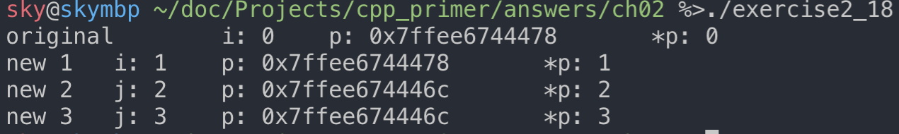

## 练习2.1

> 类型 int、long、long long 和 short 的区别是什么？无符号类型和带符号类型的区别是什么？float 和 double的区别是什么？

在C++语言中，int、long、long long 和 short 都属于整型，区别在于C++标准规定的尺寸的最小值（平台实现可以大点但不能更小）不同。其中，short 是16位，int 是16位，long 是32位，long long 是64位，C++标准允许不同的编译器实现的更大一些。

大多数整型可以分为有符号和无符号。无符号的是所有bit都用来存储数值，仅表示正整数和0；有符号的可以表示正数、负数和0.

float 和 double 分别是单精度和双精度浮点数，float 是32位，7位有效数字；double 是64位，16位有效数字。

用法：

* 一般使用 int 做整数运算，short 因为太小在实际中用的少，long 通常和 int 有着相同的大小。如果数据非常大，可以使用 long long。
* 如果你确认数据是非负的，那么就使用 unsigned 无符号类型。
* **执行浮点运算时尽量要用 double** ，因为 float 通常精度不够而且双精度浮点数和单精度浮点数的计算代价相差无几（当然嵌入式领域除外）。
  
编注：

在我的机器（macOS10.14/Centos7.5）上测试数据类型大小为（使用`sizeof()`）：

| 类型      | 字节 | 比特  |
| --------- | ---: | :---: |
| short     |    2 |  16   |
| int       |    4 |  32   |
| long      |    8 |  64   |
| long long |    8 |  64   |


参考：

- [What are the criteria for choosing between short / int / long data types?](http://www.cs.technion.ac.il/users/yechiel/c++-faq/choosing-int-size.html)
- [Difference between float and double](https://stackoverflow.com/questions/2386772/what-is-the-difference-between-float-and-double)

## 练习2.2
> 计算按揭贷款时，对于利率、本金和付款分别应选择何种数据类型？说明你的理由。

**如果要用到浮点数，尽可能用`double`**。因为`float`精度太低了，只有7位有效数字，而且`float`和`double`的运算速度差不多。在嵌入式领域才可能会考虑使用`float`，因为嵌入式系统的资源很匮乏，空间能省就省。

所以这里的利率、本金和付款都要用`double`。

## 练习2.3

> 读程序写结果。

```C++
unsigned u = 10, u2 = 42;
std::cout << u2 - u << std::endl;
std::cout << u - u2 << std::endl;

int i = 10, i2 = 42;
std::cout << i2 - i << std::endl;
std::cout << i - i2 << std::endl;
std::cout << i - u << std::endl;
std::cout << u - i << std::endl;
```

输出：

我的编译环境`int`是32位。

```
1. 32
2. 4294967264
3. 32
4. -32
5. 0
6. 0
```

解释：

在计算机里，一切数值都是补码存储，比如无符号数`1`在内存中是补码形式(1的补码还是1)的二进制，有符号数`-1`在内存中也是补码形式(-1的补码是另一个很大的数)的二进制，各种运算都是以这种补码运算的。

无符号数减无符号数还是无符号数，所以`u - u2`应该也是无符号数。因为`u - u2 = -32`，所以要把`-32`看作无符号数。在计算机里，一切数值都是补码存储，`-32`在内存中就是补码(FF FF FF E0)的形式存在的，将FF FF FF E0看作是无符号的话，就是4294967264。

有符号数减无符号数会先把有符号转为无符号数，再相减。所以`i - u`自动转为了`unsigned i - unsigned u`，对于 int 10 来说，其 unsigned 的形式也是10，所以相减是0.

**切勿混用有符号数和无符号数！**

## 练习2.4

> 编写程序检查你的估计是否正确，如果不正确，请仔细研读本节直到弄明白问题所在。

略。

## 练习2.5

> 指出下述字面值的数据类型并说明每一组内几种字面值的区别：
- (a) 'a', L'a', "a", L"a"
- (b) 10, 10u, 10L, 10uL, 012, 0xC
- (c) 3.14, 3.14f, 3.14L
- (d) 10, 10u, 10., 10e-2

答案：

- (a) 'a'是普通的字符字面值, L'a'是wchar_t类型, "a"是字符串字面值, L"a"是宽字符串字面值。
- (b) 10就是普通的十进制有符号数10, 10u是十进制无符号数10, 10L是十进制有符号数Long类型的整型10, 10uL是十进制无符号数Long类型的无符号整型10, 012是八进制整型, 0xC是十六进制整型。
- (c) 3.14是double, 3.14f是float, 3.14L是long double。
- (d) 10是十进制整型, 10u是十进制无符号整型, 10.是double, 10e-2是double（科学计数法的形式，即$10 \times 10^{-2}$）。

## 练习2.6

> 下面两组定义是否有区别，如果有，请叙述之：

```C++
int month = 9, day = 7;
int month = 09, day = 07;
```

第一行都是十进制数，第二行都是八进制数（0开头）。但是`09`这种写法是不对的，因为八进制数没有9，所以编译器报错`invalid digit '9' in octal constant`。

## 练习2.7

> 下述字面值表示何种含义？它们各自的数据类型是什么？

```C++
(a) "Who goes with F\145rgus?\012"
(b) 3.14e1L
(c) 1024f
(d) 3.14L
```

- (a) 带转义符的字符串字面值。`\145`是转义符，其中145是八进制，转为十进制就是101，对应ASCII表的`e`；`\012`同理，12的十进制是10，对应ASCII表的`LF`(换行)。原字符串等价于"Who goes with Fergus?(换行)"。
- (b) long double类型，且是科学计数法形式，$3.14\times10^{1}$.
- (c) 后缀`f`说明是float，也就是说`f`前面必须是带小数点的。但是前面是整型，所以会报错`invalid digit 'f' in decimal constant`。可以改为`1024.f`就好了。
- (d) long double.
  
## 练习2.8

> 请利用转义序列编写一段程序，要求先输出 2M，然后转到新一行。修改程序使其先输出 2，然后输出制表符，再输出 M，最后转到新一行。

```C++
#include <iostream>

int main()
{
    // 2 的 ASCII 十六进制 32
    // M 的 ASCII 十六进制 4D
    // 换行(LF,\n) 的 ASCII 十六进制 0A
    // 水平制表符(HT,\t) 的 ASCII 十六进制 09
    std::cout << "\x32\x4d\x0a";
    std::cout << "\x32\x09\x4d\x0a";
    return 0;
}
```

## 练习2.9

> 解释下列定义的含义，对于非法的定义，请说明错在何处并将其改正。

```C++
(a) std::cin >> int input_value;
(b) int i = {3.14};
(c) double salary = wage = 9999.99;
(d) int i = 3.14;
```

(a) 报错误信息，应先定义后使用。
```C++
// 改正
int input_value;
std::cin >> input_value;
```

(b) 如果clang没有设置std=c++11，报警告信息。`{}`列表初始化方式会检测是否精度丢失。
用3.14初始化int，会自动转为3，造成了精度丢失（窄化操作），这种初始化方式会导致编译器(未严格执行C++11标准的)发出警告（`warning: implicit conversion from 'double' to 'int' changes value from 3.14 to 3`）。

如果clang设置了std=c++11，报错误信息`error: type 'double' cannot be narrowed to 'int' in initializer list [-Wc++11-narrowing]`。
```C++
// 改正
double i = {3.14};
// 或者
double i(3.14);
```

(c) 报错误信息，从左到右扫描发现`wage`未定义`error: use of undeclared identifier 'wage'`。
```C++
// 改正
double wage;
double salary = wage = 9999.99;
```

(d) 报警告信息，虽然会造成精度丢失(窄化操作使`i = 3`)，但是这种初始化方式不会报错`warning: implicit conversion from 'double' to 'int' changes value from 3.14 to 3 [-Wliteral-conversion]`。

## 练习2.10

> 下列变量的初值分别是什么？

```C++
std::string global_str;
int global_int;
int main()
{
    int local_int;
    std::string local_str;
}
```

答案：
```C++
std::string global_str; // string对象本身提供了默认的初始化方法，即初始化为空串
int global_int; // 全局变量默认初始化0
int main()
{
    int local_int; // 函数内局部变量不自动初始化，随机值
    std::string local_str; // string对象本身提供了默认的初始化方法，即初始化为空串
}
```

## 练习2.11

> 指出下面的语句是声明还是定义：
```C++
(a) extern int ix = 1024;
(b) int iy;
(c) extern int iz;
```

答案：

声明只是告诉程序有这个变量存在，而定义则是实实在在的创建与名字管理的实体。一个程序中，同一个变量只能定义一次，且出现在某一个文件中，而声明则可以出现多次，出现在多个文件中。
- (a) 是定义，因为初始化了。
- (b) 声明 + 定义。
- (c) 只是声明。

## 练习2.12

> 请指出下面的名字中哪些是非法的？
- (a) int double = 3.14;
- (b) int _;
- (c) int catch-22;
- (d) int 1_or_2 = 1;
- (e) double Double = 3.14;

答案：

- (a) int double = 3.14; // 非法，double是关键字，是内置的数据类型名
- (b) int _; // 合法
- (c) int catch-22; // 非法，可以是`_`，但不能是`-`，因为与`减号`有歧义
- (d) int 1_or_2 = 1; // 非法，不能以数字开头
- (e) double Double = 3.14; // 合法
  
## 练习2.13

> 下面程序中 j 的值是多少？
```C++
int i = 42;
int main()
{
    int i = 100;
    int j = i;
}
```

`j` 的值是 `100` ，因为局部变量 `i` 覆盖了全局变量 `i` 。C++允许内层作用域重新定义外层作用域中已经有的名字。

## 练习2.14

> 下面的程序合法吗？如果合法，它将输出什么？
```C++
int i = 100, sum = 0;
for (int i = 0; i != 10; ++i)
    sum += i;
std::cout << i << " " << sum << std::endl;
```

合法，输出 100，45。外层作用域中间嵌套了内层的作用域。

## 练习2.15

> 下面的哪个定义是不合法的？为什么？

- (a) int ival = 1.01;
- (b) int &rval1 = 1.01;
- (c) int &rval2 = ival;
- (d) int &rval3;

答案：
- (a) 合法。
- (b) 非法，引用的初始值不能是字面值（必须是对象）。
- (c) 合法。
- (d) 非法，引用必须初始化，绑定某个实体对象。


## 练习2.16

> 考察下面的所有赋值然后回答：哪些赋值是不合法的？为什么？哪些赋值是合法的？它们执行了什么样的操作？

```C++
int i = 0, &r1 = i; 
double d = 0, &r2 = d;

(a) r2 = 3.14159;
(b) r2 = r1;
(c) i = r2;
(d) r1 = d;
```

都合法。

- (a) r2 就是 d。所以相当于给 d 赋值为 3.14159。
- (b) r2 就是 d，r1 就是 i，所以相当于(int 0)赋值给(double d)，会执行自动转换（int->double）。
- (c) (double 0)赋值给(int i)，会发生小数截取。
- (d) (double 0)赋值给(int i)，会发生小数截取。


## 练习2.17

> 执行下面的代码段将输出什么结果？
```C++
int i, &ri = i;
i = 5;
ri = 10;
std::cout << i << " " << ri << std::endl;
```

答案：输出 10， 10。

## 练习2.18

> 编写代码分别改变指针的值以及指针所指对象的值。

```C++
#include <iostream>

int main()
{
    int i = 0;
    int *p = &i;
    // 打印原始信息
    std::cout << "original\ti: " << i << "\t"
              << "p: " << p << "\t"
              << "*p: " << *p << std::endl;

    // 改变 p 指向的变量的值
    *p = 1;
    std::cout << "new 1\ti: " << i << "\t"
              << "p: " << p << "\t"
              << "*p: " << *p << std::endl;

    // 改变指针本身，即让 p 重新指向别的变量
    int j = 2;
    p = &j;
    std::cout << "new 2\tj: " << j << "\t"
              << "p: " << p << "\t"
              << "*p: " << *p << std::endl;

    // 通过直接修改目的变量的值，间接改变 *p
    j = 3;
    std::cout << "new 3\tj: " << j << "\t"
              << "p: " << p << "\t"
              << "*p: " << *p << std::endl;
    return 0;
}
```

输出结果：



## 练习2.19

> 说明指针和引用的主要区别

相同点：

指针和引用都是复合类型（以其他类型为基础），都与内存中实际存在的对象有联系，它们都实现了对其他对象的间接访问。

不同点：

指针“指向”内存中的某个对象，而引用则是“绑定”到内存中的某个对象。

* 指针本身就是一个对象，允许对指针赋值和拷贝，而且指针在生命周期内可以指向几个不同到对象。引用本身不是一个对象，只是一个对象的别名而已，无法将引用重新绑定到另一个对象。
* 指针无需在定义时赋初始值，与其他内置类型一样，在块作用域内定义的指针如果没有被初始化，是一个随机值。引用定义时必须赋初始值。

## 练习2.20

> 请叙述下面这段代码的作用。

```C++
int i = 42;
int *p1 = &i; 
*p1 = *p1 * *p1;
```

让指针 `p1` 指向 `i`，然后将 `i` 的值重新赋值为 42 * 42 (1764)。注意`*p1 = *p1 * *p1;`中的第三个`*`被解释为`乘号`。

## 练习2.21

> 请解释下述定义。在这些定义中有非法的吗？如果有，为什么？

```C++
int i = 0;
(a) double* dp = &i;
(b) int *ip = i;
(c) int *p = &i;
```

- (1) 非法。不能将一个指向 `double` 的指针指向 `int` ，类型不匹配。
- (2) 非法。不能将 `int` 变量赋给指针，应该取地址。
- (3) 合法。

## 练习2.22

> 假设 p 是一个 int 型指针，请说明下述代码的含义。
```C++
if (p) // ...
if (*p) // ...
```

答案：
```C++
if (p) // 如果不是空指针
if (*p) // 如果指针指向的int对象的内容不是 0
```

## 练习2.23

> 给定指针 p，你能知道它是否指向了一个合法的对象吗？如果能，叙述判断的思路；如果不能，也请说明原因。

应该是不能的，因为首先要确定这个指针是不是合法的，才能判断它所指向的对象是不是合法的。而判断一个指针是不是合法，C++ 没这个能力。不过，可以曲线救国，比如将 `if(p)` 放置于 `try` 结构中，如果p没有指向合法的对象则会执行对应的 `catch` 语句。

## 练习2.24

> 在下面这段代码中为什么 p 合法而 lp 非法？

```C++
int i = 42;
void *p = &i;
long *lp = &i;
```

`void *` 是从 C语言那里继承过来的，可以指向任何类型的对象。而其他指针类型必须要与所指对象严格匹配。

## 练习2.25

> 说明下列变量的类型和值。

- (a) int* ip, i, &r = i;
- (b) int i, *ip = 0;
- (c) int* ip, ip2;

答案：

- (a) `ip` 是指向 `int` 的指针；`i` 是 `int`；`r` 是 `int` 的引用即 `r` 绑定了 `i` 。
- (b) `i` 是 `int`；`ip` 是指向 `int` 的指针初值是空指针，不指向任何对象。
- (c) `ip` 是指向 `int` 的指针；`ip2` 是 `int` 类型。

## 练习2.26

> 下面哪些语句是合法的？如果不合法，请说明为什么？

```C++
(a) const int buf;
(b) int cnt = 0;
(c) const int sz = cnt;
(d) ++cnt; ++sz;
```

题目意思是按上面顺序执行。

```C++
(a) const int buf;      // 不合法, const 对象必须初始化
(b) int cnt = 0;        // 合法
(c) const int sz = cnt; // 合法
(d) ++cnt; ++sz;        // 不合法, const 对象不能被改变
```

## 练习2.27

> 下面的哪些初始化是合法的？请说明原因。

```C++
(a) int i = -1, &r = 0;
(b) int *const p2 = &i2;
(c) const int i = -1, &r = 0;
(d) const int *const p3 = &i2;
(e) const int *p1 = &i2;
(f) const int &const r2;
(g) const int i2 = i, &r = i;
```

```C++
(a) int i = -1, &r = 0;         // 不合法，r 必须引用一个对象，不能是字面值
(b) int *const p2 = &i2;        // 合法，const 可以绑定非 const，p2是 const，不能变即永远指向 i2，但是 p2 指向的 int 对象可以变（注意const 修饰的 p2）
(c) const int i = -1, &r = 0;   // 合法，const int &r = 0 是合法的
(d) const int *const p3 = &i2;  // 合法，p3是 const 不可变的，即永远指向 i2，同时 p3指向的也是一个不可变的 int，即不可通过 p3 修改所指对象的值
(e) const int *p1 = &i2;        // 合法，p1 是一个指针，指向 const int，即不能通过 p1 修改所指对象的值
(f) const int &const r2;        // 不合法, r2 是引用（不是对象），引用没有顶层 const，不能让引用恒定不变
(g) const int i2 = i, &r = i;   // 合法，i2 是常量；r 是常量引用，const int &r = i 合法
```

编注：
* int &r = 0; // 非法
* const int &r = 0; // 合法

## 练习2.28

> 说明下面的这些定义是什么意思，挑出其中不合法的。

```C++
(a) int i, *const cp;
(b) int *p1, *const p2;
(c) const int ic, &r = ic;
(d) const int *const p3;
(e) const int *p;
```

```C++
(a) int i, *const cp;       // 不合法, const 指针 cp 必须初始化
(b) int *p1, *const p2;     // 不合法, const 指针 p2 必须初始化
(c) const int ic, &r = ic;  // 不合法, const int ic 必须初始化
(d) const int *const p3;    // 不合法, const 指针 p3 必须初始化
(e) const int *p;           // 合法. 一个指针，指向 const int
```
注意：

**const 修饰的变量因为其值不能改变，所以必须初始化。**
例如`clang`编译如下代码会出错：
```C++
const int i;
std::cout << i << std::endl;
```
错误信息：
```C++
error: default initialization of an object of const type 'const int'
    const int i;
              ^
                = 0
1 error generated.
```

## 练习2.29

> 假设已有上一个练习中定义的那些变量，则下面的哪些语句是合法的？请说明原因。

```C++
(a) i = ic;
(b) p1 = p3;
(c) p1 = &ic;
(d) p3 = &ic;
(e) p2 = p1;
(f) ic = *p3;
```

```C++
(a) i = ic;     // 合法, 常量赋值给普通变量
(b) p1 = p3;    // 不合法, p3 是const指针不能赋值给普通指针,普通指针不能指向一个const变量
(c) p1 = &ic;   // 不合法, ic是const int，p1是普通的int*，普通指针不能指向常量
(d) p3 = &ic;   // 不合法, p3 是常量指针且指向常量，p3不能被重新赋值（不能被改变）
(e) p2 = p1;    // 不合法, p2本身是常量指针（指向的是一个整型），p2本身不能被重新赋值
(f) ic = *p3;   // 不合法, ic是const int，不可变
```

注意：

**普通指针不能指向 const 变量。** 例如下代码，
```C++
int a = 10;
const int *p = &a;

int *r = p;
std::cout << *r << std::endl;
```

编译出错：
```C++
error: cannot initialize a variable of type 'int *' with an lvalue of type 'const int *'
    int *r = p;
         ^   ~
1 error generated.
```

## 练习2.30

> 对于下面的这些语句，请说明对象被声明成了顶层const还是底层const？

```C++
const int v2 = 0;
int v1 = v2;
int *p1 = &v1, &r1 = v1;
const int *p2 = &v2, *const p3 = &i, &r2 = v2;
```

v2 是顶层const（v2本身不可变），p3 是顶层const（p3本身不可变）又是底层const（指向对象不可变）；p2 和 r2 是底层const（指向/引用的对象是const）。

说明：

顶层const或者底层const是针对“声明定义中带const字眼的变量说的”，顶层const表示本身是const的，不可变；底层const表示它指向（所引用）的那个对象是const的。

## 练习2.31

> 假设已有上一个练习中所做的那些声明，则下面的哪些语句是合法的？请说明顶层const和底层const在每个例子中有何体现。

```C++
r1 = v2;
p1 = p2;
p2 = p1;
p1 = p3;
p2 = p3;
```

```C++
r1 = v2; // 合法, v2是顶层const，顶层const在拷贝时不受影响
p1 = p2; // 不合法, p2 是底层const，如果要拷贝必须要求 p1 也必须是底层const才行
p2 = p1; // 合法, int* 可以转换成const int*（注意p2本身不是const的，p2指向的才是const）
p1 = p3; // 不合法, p3 是一个底层const，p1 不是
p2 = p3; // 合法, p2 和 p3 都是底层const，拷贝时忽略掉顶层const
```

解释：

执行拷贝操作时，顶层const和底层const区别明显。其中，顶层const不受影响，因为拷贝操作不会改变被拷贝对象的值。底层const则有限制，比如拷入和拷出对象必须拥有相同的底层const资格，或者两个兑现数据类型必须能够转换。一般来说，非常量可以转成常量，反之则不行。

## 练习2.32

> 下面的代码是否合法？如果非法，请设法将其修改正确。

```C++
int null = 0, *p = null;
```

不合法，编译错误。因为 `p` 是`int*`，`null` 是一个 `int` 变量，`*p = null` 单从语法角度来讲就是错误的，最起码是 `*p = &null` 才对。
常用的指针初始化为空指针方法有：
* `int *p = nullptr;` (C++11新关键字)
* `int *p = NULL;` (`NULL`是个宏定义，在`stddef.h`中被定义为`0`或`((void*)0)`或`nullptr`，具体看编译器，比如`C++11`就是定义为了`nullptr`)
* `int *p = 0;`

## 练习2.33

> 利用本节定义的变量，判断下列语句的运行结果。

```C++
a = 42; b = 42; c = 42;
d = 42; e = 42; g = 42;
```

答案：
```C++
a = 42; // 合法。a 是 int
b = 42; // 合法。b 是一个 int, (虽然ci是const int，但ci的顶层const在拷贝时被忽略掉了)
c = 42; // 合法。c 也是一个int, (cr是ci的别名，ci本身是const int，并且是顶层const，auto时会忽略顶层const)
d = 42; // 非法。d 是一个 int *, 不能用字面常量给指针赋值，所以语句非法
e = 42; // 非法。e 是一个 const int *, (ci是const int, 对ci取地址是一种底层const，suto时需保留)
g = 42; // 非法。g 是一个 const int 的引用，引用都是底层const，是个常量，不能修改，所以不能被赋值
```

注意：

`auto p = &a;` 这种形式的`aoto`说明`p`一定是某种类型的指针。

## 练习2.34

> 基于上一个练习中的变量和语句编写一段程序，输出赋值前后变量的内容，你刚才的推断正确吗？如果不对，请反复研读本节的示例直到你明白错在何处为止。

详见`exercise2_34.cpp`.

后三行的编译错误信息如下：
```C++
exercise2_34.cpp:20:9: error: assigning to 'int *' from incompatible type 'int'
    d = 42;
        ^~
exercise2_34.cpp:21:9: error: assigning to 'const int *' from incompatible type 'int'
    e = 42;
        ^~
exercise2_34.cpp:22:7: error: cannot assign to variable 'g' with const-qualified type 'const int &'
    g = 42;
    ~ ^
exercise2_34.cpp:12:11: note: variable 'g' declared const here
    auto &g = ci;
```

## 练习2.35

> 判断下列定义推断出的类型是什么，然后编写程序进行验证。

```C++
const int i = 42;
auto j = i; const auto &k = i; auto *p = &i; 
const auto j2 = i, &k2 = i;
```

答案：

详见`exercise2_35.cpp`.
```C++
j 是 int
k 是 const int 的引用
p 是 const int *
j2 是 const int
k2 是 const int 的引用
```
提示：使用IDE，将鼠标移动到变量名上，类型就会自动提示出来。或者使用typeid关键字检测类型，比如：
```C++
#include <typeinfo> // 需要里面的type_info class
...
// typeid是C++的关键字，返回的是type_info class
// .name()是c-string风格的字符串，不同编译器的name不同，比如
// clang/GUN g++中的int类型对应的.name()就是i; visual C++ 就是int
cout << typeid(i).name() << endl;
...

-- clang/GUN g++输出的typeid(i).name()如下 --
val j: i
val k: i
val p: PKi (注：pointer to konst/const int)
val j2: i
val k2: i
```

## 练习2.36

> 关于下面的代码，请指出每一个变量的类型以及程序结束时它们各自的值。

```C++
int a = 3, b = 4;
decltype(a) c = a;
decltype((b)) d = a;
++c;
++d;
```

答案：
注意，decltype((val)) 一定是个引用类型, 而decltype(val)只有val本身是引用时，decltype(val)才是引用的。
```C++
c 是 int 类型，结果为 4; d 是 int& 类型，即 d 是 a 的别名，++d 后的 d 结果为 4，a 最后也是 4. 总结，abcd 最后都是4.
```

## 练习2.37

> 赋值是会产生引用的一类典型表达式，引用的类型就是左值的类型。也就是说，如果 i 是 int，则表达式 i=x 的类型是 int&。根据这一特点，请指出下面的代码中每一个变量的类型和值。

```C++
int a = 3, b = 4;
decltype(a) c = a;
decltype(a = b) d = a;
```

答案：
```C++
a: int 类型，值为 3.
b: int 类型，值为 4.
c: int 类型，值为 3.
d: int& 类型，绑定到了 a，值为 3.
```
注意，`decltype(a = b)`只是推断`a = b`表达式的类型而已，并不进行真正的赋值操作，所以`a`没变。

## 练习2.38

> 说明由 decltype 指定类型和由 auto 指定类型有何区别。请举一个例子，decltype 指定的类型与 auto 指定的类型一样；再举一个例子，decltype 指定的类型与 auto 指定的类型不一样。

答案：

decltype 和 auto 都是类型推断的方式，区别在于，

1. auto是用编译器计算变量的初始值来推断其类型（需要计算表达式结果），而decltype只通过分析表达式得到类型而已，并不会真正计算表达式结果。
2. auto推断出来的类型有时与初始值的类型并不完全一致，编译器会适当的改变类型以使其更符合初始化规则。比如，auto一般会忽略掉顶层const，保留底层const；而decltype会保留顶层const。
3. decltype的结果类型与**表达式形式**密切相关，比如`decltype(val)`和`decltype((val))`推断的类型就不同，前者推断的类型就是`val`本身的类型，后者推断的类型会强制改为引用类型。

举例：
```C++
#include <iostream>

using std::cout;
using std::endl;

int main()
{
    int a = 1;
    auto b = a; // a 是 int， 所以 auto b 也是 int
    decltype(a) c = a; // a 是 int，所以 decltype(a) 也是 int
    decltype((a)) d = a; // 加了括号 (a)就会变成引用类型，所以 decltype((a)) 是 int &，所以d是a的别名
    cout << a << " " << b << " " << c << " " << d << endl;
    ++b; // int 
    ++c; // int
    ++d; // int &, d 绑定到了 a, d 自增导致 a 也自增
    cout << a << " " << b << " " << c << " " << d << endl;
    cout << endl;

    const int a2 = 1;
    auto b2 = a2; // a2 是顶层 const, auto b2 推断会去掉顶层 const，所以 b2 是 int
    decltype(a2) c2 = a2; // decltype(a2) 就是 a2 的类型, 即 const int
    decltype((a2)) d2 = a2; // 加了括号就是引用类型了, 即 const int &
    cout << a2 << " " << b2 << " " << c2 << " " << d2 << endl;
    ++b2;
    // ++c2; // clang error: cannot assign to variable 'c2' with const-qualified type 'decltype(a2)' (aka 'const int')
    // ++d2; // clang error: cannot assign to variable 'd2' with const-qualified type 'decltype((a2))' (aka 'const int &')
    cout << a2 << " " << b2 << " " << c2 << " " << d2 << endl;
    return 0;
}
```

## 练习2.39

> 编译下面的程序观察其运行结果，注意，如果忘记写类定义体后面的分号会发生什么情况？记录下相关的信息，以后可能会有用。

```C++
struct Foo { /* 此处为空  */ } // 注意：没有分号
int main()
{
    return 0;
}
```

Clang编译错误信息如下：
```C++
error: expected ';' after struct
struct Foo { /* 此处为空  */ } // 注意：没有分号
                              ^
                              ;
1 error generated.
```
编译器会提示`struct`后面需要(expect)一个分号。C++定义`struct/class`时一定要在后面加分号！原因：struct/class后面是可以加一个变量名的（表示该变量就是这个类型的），不加分号的话会以为后面有个变量名（但是没有，所以会报错）。

## 练习2.40

> 根据自己的理解写出 Sales_data 类，最好与书中的例子有所区别。

```C++
// struct默认是共有的，class默认是私有的
// 除此之外，struct与class大同小异
struct Sales_data
{
    std::string bookNo;          // 书籍编号
    std::string bookName;        // 书名
    unsigned int units_sold = 0; // 销售量
    double revenue = 0.0;        // 销售收入
    double sellingprice = 0.0;   // 零售价
    double saleprice = 0.0;      // 实售价
    double discount = 0.0;       // 折扣，按 discount = saleprice / sellingprice 计算
};
```

## 练习2.41

> 使用你自己的Sale_data类重写1.5.1节（第20页）、1.5.2节（第21页）和1.6节（第22页）的练习。眼下先把Sales_data类的定义和main函数放在一个文件里。

####1.5.1


## 练习2.42

> 根据你自己的理解重写一个Sales_data.h头文件，并以此为基础重做2.6.2节（第67页）的练习。

